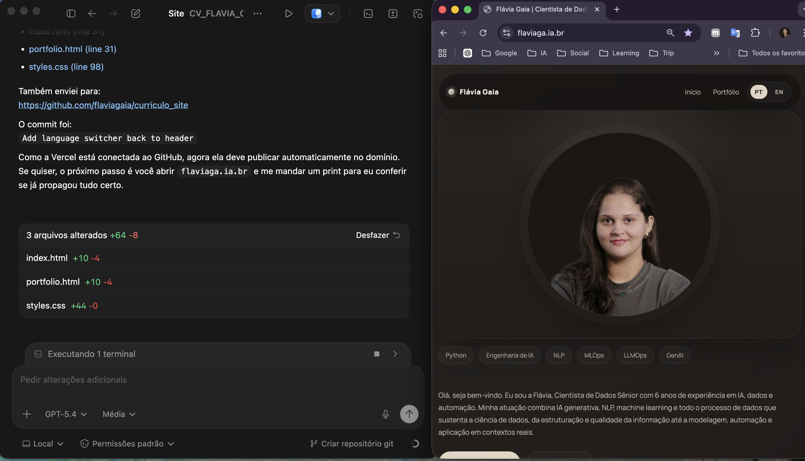

# Curriculo Site

Site pessoal e portfólio técnico de Flávia Gaia, criado para substituir o Linktree por uma presença digital mais forte para recrutadores, entrevistas técnicas e apresentação de projetos.

Personal website and technical portfolio by Flávia Gaia, created to replace Linktree with a stronger digital presence for recruiters, technical interviews, and project presentation.

## PT-BR

### Sobre o projeto

Este repositório reúne um site estático com:

- página inicial de apresentação profissional;
- página de portfólio com projetos e detalhes técnicos;
- versão em português e inglês;
- links para currículo, TCCs e perfis técnicos;
- publicação em domínio próprio via Vercel.

### Como foi construído

Este projeto foi desenvolvido com uma abordagem de **vibe coding**, usando o **Codex** como ferramenta de apoio para:

- prototipação rápida da interface;
- refinamento iterativo de texto e layout;
- organização do portfólio técnico;
- ajustes visuais e navegação;
- preparação para deploy e publicação.

### Stack

- `HTML`
- `CSS`
- `JavaScript`
- `GitHub`
- `Vercel`

### Estrutura principal

- `index.html`: home principal
- `portfolio.html`: portfólio técnico
- `index-en.html`: home em inglês
- `portfolio-en.html`: portfólio em inglês
- `styles.css`: estilos globais
- `script.js`: interações da interface

### Deploy

O site está preparado para deploy estático na Vercel.

### Objetivo

Centralizar em um único endereço a apresentação profissional, os projetos, a produção técnica e os materiais de apoio para processos seletivos.

---

## EN

### About the project

This repository contains a static website with:

- a professional landing page;
- a portfolio page with projects and technical details;
- Portuguese and English versions;
- links to resume, thesis projects, and technical profiles;
- deployment on a custom domain through Vercel.

### How it was built

This project was developed using a **vibe coding** approach, with **Codex** as a support tool for:

- rapid interface prototyping;
- iterative refinement of copy and layout;
- technical portfolio organization;
- visual and navigation adjustments;
- deployment preparation and publishing.

### Stack

- `HTML`
- `CSS`
- `JavaScript`
- `GitHub`
- `Vercel`

### Main structure

- `index.html`: main home page
- `portfolio.html`: technical portfolio
- `index-en.html`: English home page
- `portfolio-en.html`: English portfolio
- `styles.css`: global styles
- `script.js`: interface interactions

### Deploy

The website is ready for static deployment on Vercel.

### Goal

To centralize professional presentation, projects, technical content, and supporting materials for recruiting and interview processes in a single website.
